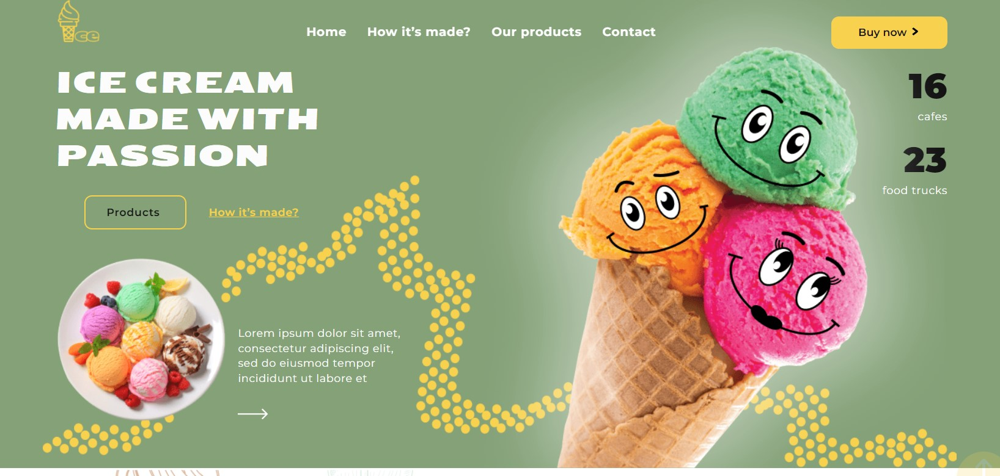
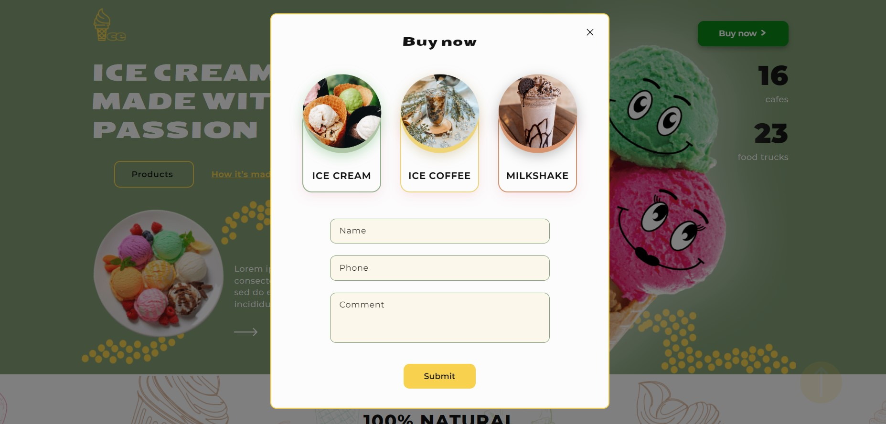
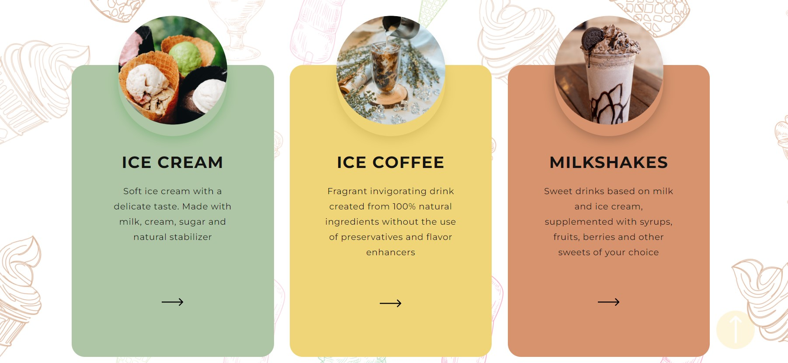
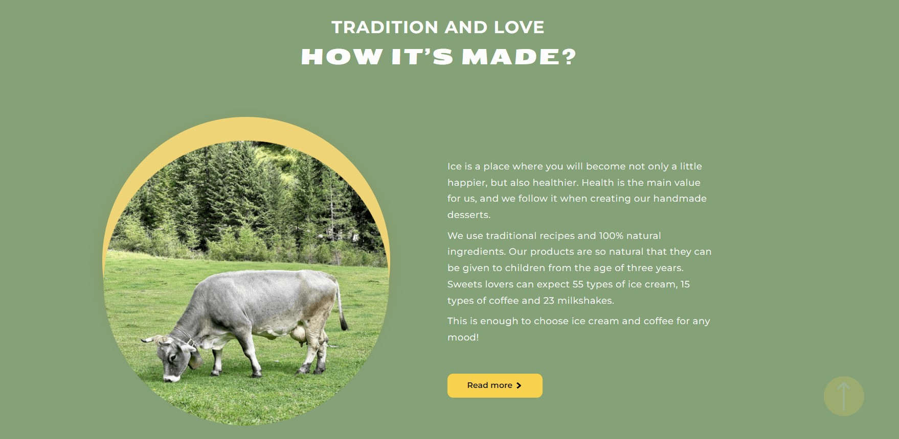
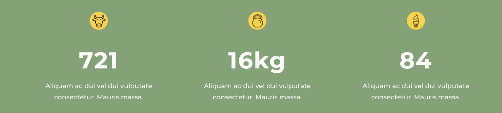
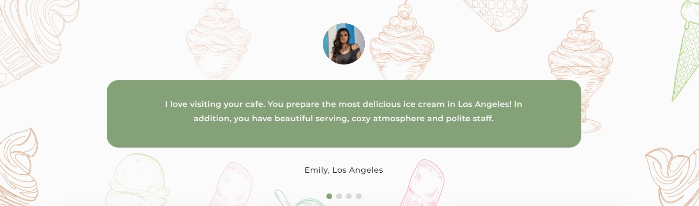
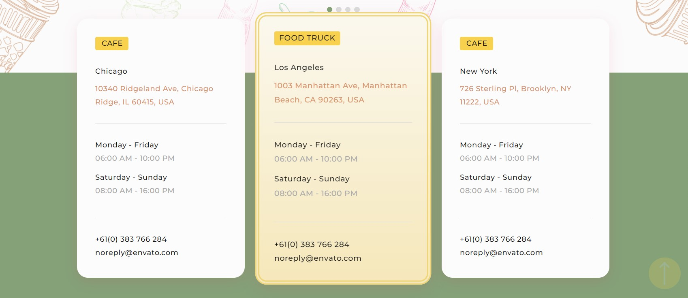
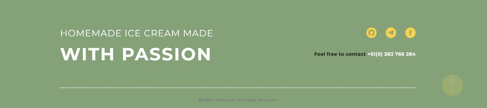

# Ice-Cream Landing Page

This project was created with the aim of increasing ice cream sales and
expanding the network of ice cream shops. It can be used as an independent
advertising platform or as an actual addition to large-scale offline advertising
campaigns of the network.

The project was develloped by 'We do IT' team.  
Team leader: <a href="https://github.com/Milosska">Liudmyla Deinychenko</a>  
Scrum master: <a href="https://github.com/SergyChamata">Serhyi Chamata</a>

### Header-Hero section

The header of the landing page includes section navigation, provides user with
information about current number of cafes and food trucks working within the
network, and is supplemented with visual effects, due to which the consumer can
spend a lot of time on the site imperceptibly for himself. It also includes "Buy
now" button, that opens the modal window, where cosumer can quickly make the
order.

Developers: <a href="https://github.com/IrynaVal">Iryna Petrenko</a>,
<a href="https://github.com/dariia-velychko">Daria Velychko</a>

### Products section

This section provides consumer with information about products for sale, their
ingredients, and allows to open a modal window with the nutritional data on each
product.

Developers: <a href="https://github.com/Oleh202208">Oleh Polupan</a>

### How it's made section

This section presents the process of saled foods preparation. It includes
general information, bright animationa, and modal windiw with video about the
ice-cream preparation technology.

  
Developers: <a href="https://github.com/Tatiana1910">Tetiana Kramarenko</a>

### Statistics section

Small section with sales statistics.

  
Developers: <a href="https://github.com/SergyChamata">Serhyi Chamata</a>

### Gallery section

Small gallery that provides consumers with photos of the latest products.
  
Developers: <a href="https://github.com/IrynaVal">Iryna Petrenko</a>

### Feedback section

Section contains slider with the reviews of different customers.
  
Developers: <a href="https://github.com/AlexGusl97">Oleksandr Husliakov </a>

### Contacts section

This section provides consumer with all necessary info about shops - their
working hours, location, contact phone and email. It also contains two modals -
the first one specifies shop's location on the map, and the second allows
potential franchaisee to leave some personal contact data for futher
communication.  
  
Developers: <a href="https://github.com/Olga-Melnyk">Olga Melnyk</a>

### Footer section

Footer section includes some interactive hover effects and all the social media
links of the product owner.  
  
Developers: <a href="https://github.com/Luidmyla007">Liudmyla Datsenko</a>

## Technology Stack

The project was made using indicated tech stack:

	<code></code>
	<code></code>
	<code></code>
	<code></code>
	<code></code>
    <code></code>
	<code></code>
	<code></code>
	

